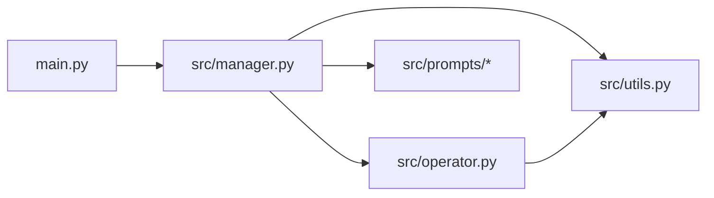
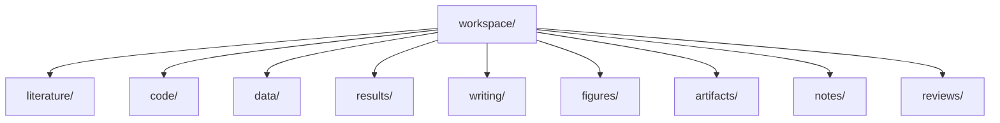
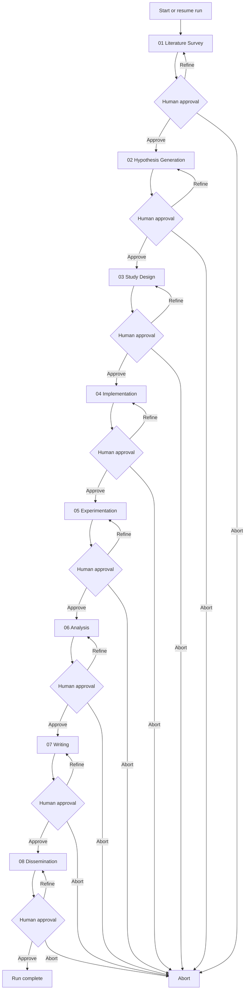
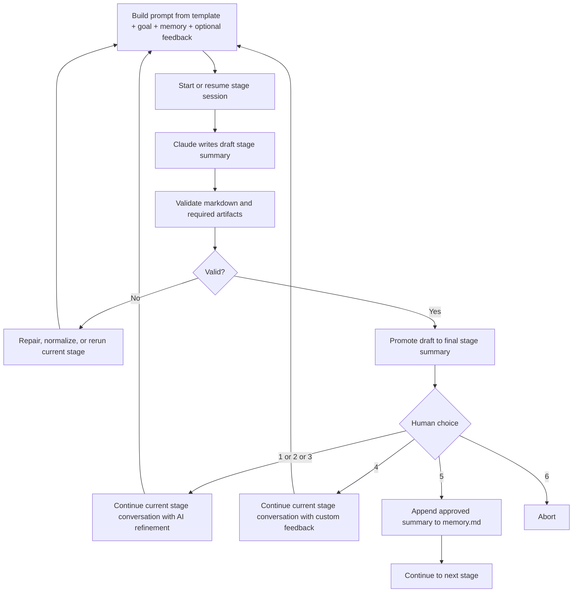

# AutoR

AutoR is a terminal-first research workflow runner for long-form AI-assisted research. It takes a research goal, runs a fixed 8-stage pipeline with Claude Code, and requires explicit human approval after every stage before the workflow can continue.

Each run is isolated under `runs/<run_id>/`. AutoR is intentionally file-based: prompts, logs, stage outputs, and research artifacts are all written into the run directory so the workflow is inspectable, resumable, and auditable.

## Overview

AutoR uses a fixed stage order:

1. `01_literature_survey`
2. `02_hypothesis_generation`
3. `03_study_design`
4. `04_implementation`
5. `05_experimentation`
6. `06_analysis`
7. `07_writing`
8. `08_dissemination`

Core constraints:

- One primary Claude invocation per stage attempt. Repair and fallback invocations are operator-managed.
- Every stage writes a draft summary to `stages/<stage>.tmp.md`.
- AutoR validates the draft, then promotes it to `stages/<stage>.md`.
- Human approval is mandatory after every validated stage.
- Each stage keeps its own Claude conversation state.
- `1/2/3/4` continue the current stage conversation with refinement feedback. Only `5` advances. `6` aborts.
- Approved stage summaries are appended to `memory.md`.
- `main.py` defaults to `--model sonnet`, but the model can be overridden per run.

The main code lives in:

- [main.py](main.py)
- [src/manager.py](src/manager.py)
- [src/operator.py](src/operator.py)
- [src/utils.py](src/utils.py)
- [src/prompts/](src/prompts)

## Code Structure



File boundaries:

- [main.py](main.py): CLI entry point. Starts a new run or resumes an existing run.
- [src/manager.py](src/manager.py): Owns the 8-stage loop, approval flow, repair flow, resume, redo-stage logic, and stage-level continuation policy.
- [src/operator.py](src/operator.py): Invokes Claude CLI, streams output live, persists stage session IDs, resumes the same stage conversation for refinement, and falls back to a fresh session if resume fails.
- [src/utils.py](src/utils.py): Stage metadata, prompt assembly, run paths, markdown validation, and artifact validation.
- [src/prompts/](src/prompts): Per-stage prompt templates.

## Workspace Structure

Each run contains `user_input.txt`, `memory.md`, `prompt_cache/`, `operator_state/`, `stages/`, `workspace/`, `logs.txt`, and `logs_raw.jsonl`. The substantive research payload lives in `workspace/`.



Directory boundaries:

- `literature/`: papers, benchmark notes, survey tables, reading artifacts.
- `code/`: runnable pipeline code, scripts, configs, and method implementations.
- `data/`: machine-readable datasets, manifests, processed splits, caches, and loaders.
- `results/`: machine-readable metrics, predictions, ablations, tables, and evaluation outputs.
- `writing/`: manuscript sources, LaTeX, section drafts, tables, and bibliography.
- `figures/`: plots, diagrams, charts, and paper figures.
- `artifacts/`: compiled PDFs and packaged deliverables.
- `notes/`: temporary notes and setup material.
- `reviews/`: critique notes, threat-to-validity notes, and readiness reviews.

Other run state:

- `memory.md`: approved cross-stage memory only.
- `prompt_cache/`: exact prompts used for stage attempts and repairs.
- `operator_state/`: per-stage Claude session IDs.
- `stages/`: draft and promoted stage summaries.
- `logs.txt` and `logs_raw.jsonl`: workflow logs and raw Claude stream output.

## Workflow



## Stage Attempt Loop



Stage-loop rules:

- Claude never writes directly to the final stage file.
- The final stage file exists only after validation succeeds.
- The first attempt of a stage starts a fresh Claude session.
- Later refinements reuse the same stage session whenever possible.
- If validation still fails after repair and normalization, AutoR keeps working inside the same stage and falls back to a fresh session only if resume fails.
- The stage loop is controlled by AutoR, not by Claude.

## Prompt and Execution

For each stage attempt, AutoR assembles a prompt from:

1. the stage template from [src/prompts/](src/prompts)
2. the required stage summary contract
3. execution discipline and output-path constraints
4. `user_input.txt`
5. approved `memory.md`
6. optional refinement feedback
7. for continuation attempts, the current stage draft/final files and existing workspace state

AutoR writes the assembled prompt to `runs/<run_id>/prompt_cache/`, stores per-stage session IDs in `runs/<run_id>/operator_state/`, and invokes Claude in streaming mode through [src/operator.py](src/operator.py).

First attempt for a stage:

```bash
claude --model <model> \
  --permission-mode bypassPermissions \
  --dangerously-skip-permissions \
  --session-id <stage_session_id> \
  -p @runs/<run_id>/prompt_cache/<stage>_attempt_<nn>.prompt.md \
  --output-format stream-json \
  --verbose
```

Continuation attempt for the same stage:

```bash
claude --model <model> \
  --permission-mode bypassPermissions \
  --dangerously-skip-permissions \
  --resume <stage_session_id> \
  -p @runs/<run_id>/prompt_cache/<stage>_attempt_<nn>.prompt.md \
  --output-format stream-json \
  --verbose
```

Refinement attempts reuse the same `stage_session_id` instead of opening a new stage conversation.

The streamed Claude output is shown live in the terminal and also captured in `logs_raw.jsonl`.

## Validation

AutoR validates both the stage markdown and the stage artifacts.

Required stage markdown shape:

```md
# Stage X: <name>

## Objective
## Previously Approved Stage Summaries
## What I Did
## Key Results
## Files Produced
## Suggestions for Refinement
## Your Options
```

Additional markdown requirements:

- Exactly 3 numbered refinement suggestions.
- The fixed 6 user options.
- No unfinished placeholders such as `[In progress]`, `[Pending]`, `[TODO]`, or `[TBD]`.
- Concrete file paths in `Files Produced`.

Artifact requirements by stage:

- Stage 03+: machine-readable data under `workspace/data/`
- Stage 05+: machine-readable results under `workspace/results/`
- Stage 06+: figure files under `workspace/figures/`
- Stage 07+: NeurIPS-style LaTeX sources plus a compiled PDF under `workspace/writing/` or `workspace/artifacts/`
- Stage 08+: review and readiness artifacts under `workspace/reviews/`

A run with only markdown notes does not pass validation.

## CLI

Start a new run:

```bash
python main.py
```

Start a new run with an inline goal:

```bash
python main.py --goal "Your research goal here"
```

Run fake mode:

```bash
python main.py --fake-operator --goal "Smoke test"
```

Run with the default model explicitly:

```bash
python main.py --model sonnet
```

Run with a different Claude model alias:

```bash
python main.py --model opus
```

Resume the latest run:

```bash
python main.py --resume-run latest
```

Resume a specific run:

```bash
python main.py --resume-run 20260329_210252
```

Redo from a specific stage inside the same run:

```bash
python main.py --resume-run 20260329_210252 --redo-stage 03
```

`--resume-run ... --redo-stage ...` continues inside the existing run directory. It does not create a new run.

Valid stage identifiers include `03`, `3`, and `03_study_design`.

## Scope

Included:

- fixed 8-stage workflow
- one primary Claude invocation per stage attempt
- mandatory human approval after every stage
- stage-local Claude conversation continuation within a stage
- AI refine, custom refine, approve, and abort
- isolated run directories
- live Claude streaming output
- repair passes and rerun fallback
- draft-to-final stage promotion
- resume and redo-stage support
- artifact-level validation

Out of scope:

- multi-agent orchestration
- database-backed state
- web UI
- concurrent stage execution
- automatic reviewer scoring

## Notes

- `runs/` is gitignored.
- AutoR implements the workflow control layer. Submission-grade output still depends on the environment, available tools, data access, model access, and the quality of the stage attempts.
