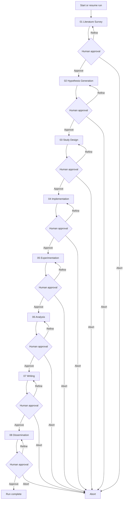
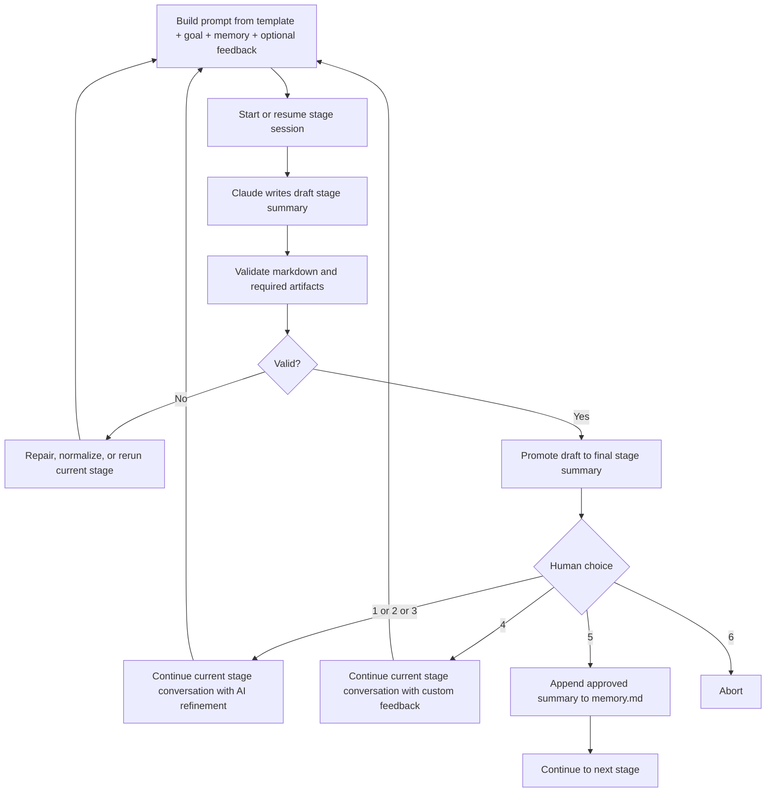
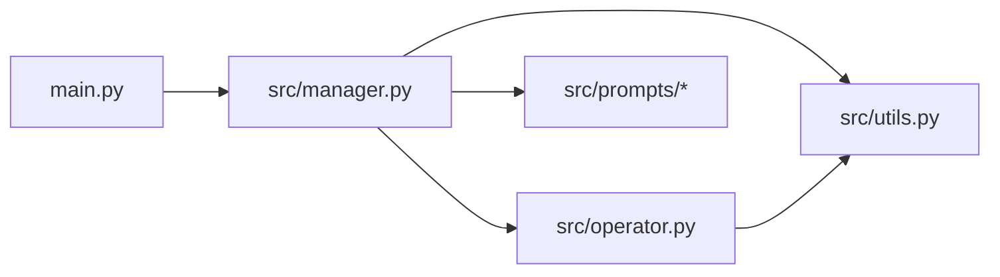
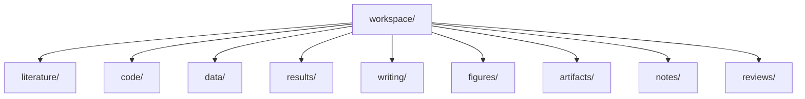

# AutoR

> A terminal-first research workflow runner for long-form AI-assisted research.


AutoR takes a research goal, runs a fixed 8-stage pipeline with Claude Code, and requires explicit human approval after every stage before the workflow can continue. Every run is isolated under `runs/<run_id>/`, and all prompts, logs, stage outputs, and research artifacts stay inside that run directory.

The project is intentionally file-based. The goal is not just to produce text, but to make long-form AI research inspectable, resumable, auditable, and artifact-driven.

## ✨ What AutoR Does

AutoR uses a fixed stage order:

1. `01_literature_survey`
2. `02_hypothesis_generation`
3. `03_study_design`
4. `04_implementation`
5. `05_experimentation`
6. `06_analysis`
7. `07_writing`
8. `08_dissemination`

Core guarantees:

- One primary Claude invocation per stage attempt. Repair and fallback invocations are operator-managed.
- Every stage writes a draft summary to `stages/<stage>.tmp.md`.
- AutoR validates the draft, then promotes it to `stages/<stage>.md`.
- Human approval is mandatory after every validated stage.
- Each stage keeps its own Claude conversation state.
- `1/2/3/4` continue the current stage conversation with refinement feedback. Only `5` advances. `6` aborts.
- Approved stage summaries are appended to `memory.md`.
- `main.py` defaults to `--model sonnet`, but the model can be overridden per run.

Stage 07 is now strengthened with:

- a venue registry for conference and journal-style targets, with NeurIPS as the default and journal-style profiles available when requested
- a writing manifest generated from existing figures, results, data files, and approved stage summaries
- stronger writing-stage artifact checks for venue-aware `main.tex`, bibliography assets, section files, `paper.pdf`, `build_log.txt`, `citation_verification.json`, and `self_review.json`
- a more explicit paper-production prompt covering venue selection, drafting, polish, self-review, compilation, and packaging

## 🌟 Example Run

AutoR has already been used end-to-end on a real run: `runs/20260330_101222`.

That run produced:

- a compiled paper PDF: [example_paper.pdf](assets/examples/example_paper.pdf)
- publication-style figures: accuracy comparison, ablation analysis, and a two-layer narrative figure
- executable code, structured datasets, machine-readable results, review notes, and dissemination artifacts

Highlighted outcomes from that run:

- AGSNv2 achieved the best result on Actor: `36.21 ± 1.08`
- the system produced a full NeurIPS-style paper package
- the final run included real figures, structured result files, and human-steered refinement across multiple stages

### 🧪 Example Figures

**Accuracy comparison across models and datasets**


**Ablation and Actor result summary**


**Two-layer narrative figure from the final paper**


### 📄 Paper Preview

The same run also produced a full 9-page conference-style paper in NeurIPS format. These snapshots are taken directly from the final `main.pdf`.

<table>
  <tr>
    <td align="center" valign="top">
      <strong>Page 1</strong><br />
      Title, abstract, and framing<br />
      
    </td>
    <td align="center" valign="top">
      <strong>Page 5</strong><br />
      Method and training algorithm<br />
      
    </td>
    <td align="center" valign="top">
      <strong>Page 7</strong><br />
      Main tables and per-seed results<br />
      
    </td>
  </tr>
</table>

### 🧑‍🔬 Human-in-the-Loop Example

This run also shows why the workflow is human-centered rather than fully automatic. The user did not just approve stages; they redirected the research when needed:

- **Stage 02**: narrowed the project to a single core claim, forcing the hypothesis space to become much sharper
- **Stage 04**: required downloading the full dataset and running real pre-checks instead of stopping at code-only implementation
- **Stage 05**: repeatedly pushed the system to rerun experiments in a cleaner environment until real benchmark results were obtained
- **Stage 06**: redirected the analysis from a leaderboard-only story toward a mechanism-driven two-layer narrative

The result is not just “automation.” It is a workflow where human judgment intervenes at high-leverage moments while Claude Code handles the heavy execution path.

## 🚀 Quick Start

Start a new run:

```bash
python main.py
```

Start a new run with an inline goal:

```bash
python main.py --goal "Your research goal here"
```

Run fake mode:

```bash
python main.py --fake-operator --goal "Smoke test"
```

Run with the default model explicitly:

```bash
python main.py --model sonnet
```

Run with a different Claude model alias:

```bash
python main.py --model opus
```

Run with an explicit writing venue profile:

```bash
python main.py --venue nature
```

If `--venue` is omitted, AutoR defaults to `neurips_2025`.

Resume the latest run:

```bash
python main.py --resume-run latest
```

Redo from a specific stage inside the same run:

```bash
python main.py --resume-run 20260329_210252 --redo-stage 03
```

`--resume-run ... --redo-stage ...` continues inside the existing run directory. It does not create a new run.

Valid stage identifiers include `03`, `3`, and `03_study_design`.

## 🗺️ Workflow



## 🔁 Stage Attempt Loop



Stage-loop rules:

- Claude never writes directly to the final stage file.
- The final stage file exists only after validation succeeds.
- The first attempt of a stage starts a fresh Claude session.
- Later refinements reuse the same stage session whenever possible.
- If validation still fails after repair and normalization, AutoR keeps working inside the same stage and falls back to a fresh session only if resume fails.
- The stage loop is controlled by AutoR, not by Claude.

## 🧠 Execution Model

For each stage attempt, AutoR assembles a prompt from:

1. the stage template from [src/prompts/](src/prompts)
2. the required stage summary contract
3. execution discipline and output-path constraints
4. `user_input.txt`
5. approved `memory.md`
6. optional refinement feedback
7. for continuation attempts, the current stage draft/final files and existing workspace state

AutoR writes the assembled prompt to `runs/<run_id>/prompt_cache/`, stores per-stage session IDs in `runs/<run_id>/operator_state/`, and invokes Claude in streaming mode through [src/operator.py](src/operator.py).

First attempt for a stage:

```bash
claude --model <model> \
  --permission-mode bypassPermissions \
  --dangerously-skip-permissions \
  --session-id <stage_session_id> \
  -p @runs/<run_id>/prompt_cache/<stage>_attempt_<nn>.prompt.md \
  --output-format stream-json \
  --verbose
```

Continuation attempt for the same stage:

```bash
claude --model <model> \
  --permission-mode bypassPermissions \
  --dangerously-skip-permissions \
  --resume <stage_session_id> \
  -p @runs/<run_id>/prompt_cache/<stage>_attempt_<nn>.prompt.md \
  --output-format stream-json \
  --verbose
```

Refinement attempts reuse the same `stage_session_id` instead of opening a new stage conversation. The streamed Claude output is shown live in the terminal and also captured in `logs_raw.jsonl`.

## 🏗️ Architecture

The main code lives in:

- [main.py](main.py)
- [src/manager.py](src/manager.py)
- [src/operator.py](src/operator.py)
- [src/utils.py](src/utils.py)
- [src/prompts/](src/prompts)



File boundaries:

- [main.py](main.py): CLI entry point. Starts a new run or resumes an existing run.
- [src/manager.py](src/manager.py): Owns the 8-stage loop, approval flow, repair flow, resume, redo-stage logic, and stage-level continuation policy.
- [src/operator.py](src/operator.py): Invokes Claude CLI, streams output live, persists stage session IDs, resumes the same stage conversation for refinement, and falls back to a fresh session if resume fails.
- [src/utils.py](src/utils.py): Stage metadata, prompt assembly, run paths, markdown validation, and artifact validation.
- [src/prompts/](src/prompts): Per-stage prompt templates.

## 📂 Run Layout

Each run contains `user_input.txt`, `memory.md`, `run_manifest.json`, `artifact_index.json`, `prompt_cache/`, `operator_state/`, `stages/`, `workspace/`, `logs.txt`, and `logs_raw.jsonl`. The substantive research payload lives in `workspace/`.



Workspace directories:

- `literature/`: papers, benchmark notes, survey tables, reading artifacts.
- `code/`: runnable pipeline code, scripts, configs, and method implementations.
- `data/`: machine-readable datasets, manifests, processed splits, caches, and loaders.
- `results/`: machine-readable metrics, predictions, ablations, tables, and evaluation outputs.
  AutoR also standardizes `results/experiment_manifest.json` as a machine-readable summary over result, code, and note artifacts for downstream analysis.
- `writing/`: manuscript sources, LaTeX, section drafts, tables, and bibliography.
- `figures/`: plots, diagrams, charts, and paper figures.
- `artifacts/`: compiled PDFs and packaged deliverables.
- `notes/`: temporary notes and setup material.
- `reviews/`: critique notes, threat-to-validity notes, and readiness reviews.

Other run state:

- `memory.md`: approved cross-stage memory only.
- `run_manifest.json`: machine-readable run and stage lifecycle state.
- `artifact_index.json`: machine-readable index over `workspace/data`, `workspace/results`, and `workspace/figures`.
- `prompt_cache/`: exact prompts used for stage attempts and repairs.
- `operator_state/`: per-stage Claude session IDs.
- `stages/`: draft and promoted stage summaries.
- `logs.txt` and `logs_raw.jsonl`: workflow logs and raw Claude stream output.

## ✅ Validation

AutoR validates both the stage markdown and the stage artifacts.

Required stage markdown shape:

```md
# Stage X: <name>

## Objective
## Previously Approved Stage Summaries
## What I Did
## Key Results
## Files Produced
## Suggestions for Refinement
## Your Options
```

Additional markdown requirements:

- Exactly 3 numbered refinement suggestions.
- The fixed 6 user options.
- No unfinished placeholders such as `[In progress]`, `[Pending]`, `[TODO]`, or `[TBD]`.
- Concrete file paths in `Files Produced`.

Artifact requirements by stage:

- Stage 03+: machine-readable data under `workspace/data/`
- Stage 05+: machine-readable results under `workspace/results/`
- Stage 05+: `workspace/results/experiment_manifest.json` must exist and remain structurally valid
- Stage 06+: figure files under `workspace/figures/`
- Stage 07+: venue-aware conference or journal-style LaTeX sources plus a compiled PDF under `workspace/writing/` or `workspace/artifacts/`
- Stage 08+: review and readiness artifacts under `workspace/reviews/`

A run with only markdown notes does not pass validation.

## 📌 Scope

Included:

- fixed 8-stage workflow
- one primary Claude invocation per stage attempt
- mandatory human approval after every stage
- stage-local Claude conversation continuation within a stage
- AI refine, custom refine, approve, and abort
- isolated run directories
- live Claude streaming output
- repair passes and rerun fallback
- draft-to-final stage promotion
- resume and redo-stage support
- artifact-level validation

Out of scope:

- multi-agent orchestration
- database-backed state
- web UI
- concurrent stage execution
- automatic reviewer scoring

## 📝 Notes

- `runs/` is gitignored.
- AutoR implements the workflow control layer. Submission-grade output still depends on the environment, available tools, data access, model access, and the quality of the stage attempts.

## 🛣️ Roadmap

Open work is tracked here so contributors can pick up clear, decoupled improvements.

- ~~Stage-local continuation sessions.~~ Keep one Claude conversation per stage, reuse it for `1/2/3/4` refinement, and fall back to a fresh session only when resume fails. This is now implemented in the operator and manager flow.
- ~~Artifact-level validation for non-toy outputs.~~ Enforce machine-readable data, result files, figures, LaTeX sources, PDF output, and review artifacts at the right stages. This is now part of the workflow validation path.
- Cross-stage rollback and invalidation. When a later stage reveals that an earlier design decision is wrong, the workflow should be able to jump back to an earlier stage and mark downstream stages as stale. This is the biggest current control-flow gap.
- Machine-readable run manifest. Add a single source of truth such as `run_manifest.json` to track stage status, approval state, stale dependencies, session IDs, and key artifact pointers. This should make both automation and future UI work much cleaner.
- Continuation handoff compression. Add a short machine-generated stage handoff file that summarizes what is already correct, what is missing, and which files matter most. This should reduce context growth and make continuation more stable over long runs.
- ~~Result schema and artifact indexing.~~ Standardize `workspace/data/`, `workspace/results/`, and `workspace/figures/` around explicit schemas and generate an artifact index automatically. The workflow now writes `artifact_index.json`, carries basic inferred or declared schema metadata, and feeds the index into later-stage prompt context and the writing manifest.
- Writing pipeline hardening. Turn Stage 07 into a reliable manuscript production pipeline with stable conference and journal-style paper structures, bibliography handling, table and figure inclusion, and reproducible PDF compilation. The goal is a submission-ready paper package, not just writing notes.
- Review and dissemination package. Expand Stage 08 so it produces readiness checklists, threats-to-validity notes, artifact manifests, release notes, and external-facing research bundles. The final stage should feel like packaging a paper for real release, not just wrapping up text.
- Frontend run dashboard. Build a lightweight UI that can browse runs, stage status, summaries, logs, artifacts, and validation failures. It should read from the run directory and manifest rather than introducing a database first.
- README and open-source assets. Keep refining the README and add `assets/` images such as workflow diagrams, UI screenshots, and artifact examples. This is important for open-source clarity, onboarding, and project presentation.

## 🌍 Community

Join the project community channels:

| Discord | WeChat | WhatsApp |
| --- | --- | --- |
|  |  |  |

## ⭐ Star History

[](https://star-history.com/#AutoX-Labs/AutoR&Date)
